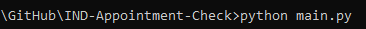

# IND Appointment Check

(On Python)

## Are you tired of having an appointment scheduled in 2 months?

This script allows you to query the IND API and find the earliest appointment possible.
It will check every 5 seconds, which will usually guarantee you an appointment the very next day if someone cancels.

(Keep in mind this only checks for available appointments, you have to book it yourself)

## Quickstart

Unfortunately, online Python interpreters are blocking network for the code because of abuses.
So the local interpreter is needed to run this code.

If you have a Python interpreter you can do the following steps (otherwise read the next subsection first):

1. Open the directory in your shell/terminal/command prompt/... with the `main.py` file
   1. On Linux and Mac:
      1. Open Terminal if it is not open
      2. Use command `cd` to open the directory: e.g. `cd ~/Downloads/IND-Appointment-Check`
   2. On Windows:
      1. Open the directory in Explorer
      2. Type `cmd` in the address bar 
      3. Hit `Enter` button on the keyboard
2. Run the code
   1. Type `python main.py` (On Mac and Linux try `python3 main.py` first) How it looks like on Windows: 
   2. If the command above say that command `python` is not found or similar then:
      1. Use the full path to Python interpreter:
         1. E.g. on Linux and Mac `\usr\bin\python3 main.py`
         2. E.g. on Windows `C:/Python/python main.py` or `%LOCALAPPDATA%\Programs\Python\Python310\python` (`310` is a sample interpreter version)
      2. Maybe you do not have any Python interpreter :)
3. If you see `SyntaxError`  then you have too old or too new Python. 3.7-3.10 is working fine for sure. Try/install one of these versions.

### If you have no Python interpreter or not working version of interpreter

1. For Linux the process is straightforward, just find the instruction for your distributive.
2. For Mac and Windows there are instructions but the installation wizard has many options that are not usually covered.
   1. For Mac `brew` or the official installation utility can be used.
   2. The official installation utilities are on [https://www.python.org/downloads/](https://www.python.org/downloads/). Choose the right OS.
   3. "Add Python to PATH" means that you can call `python` without the full path (see running examples above). However, it overwrites another `python`. Be careful.
   4. You need nothing from the optional features for this app but at least `pip` and `py launcher` are recommended to install to avoid some problems in the future.
   5. "Add Python to environment variables" is the same as "Add Python to PATH".
   6. Other options can be left as-is.

---
© Vadim Isakov and Nick Veld

Licensed under the [GNU General Public License](LICENSE)